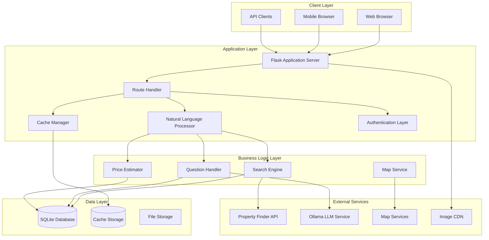
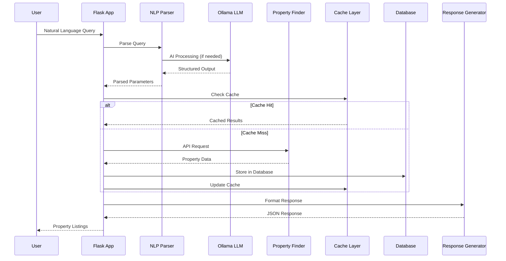
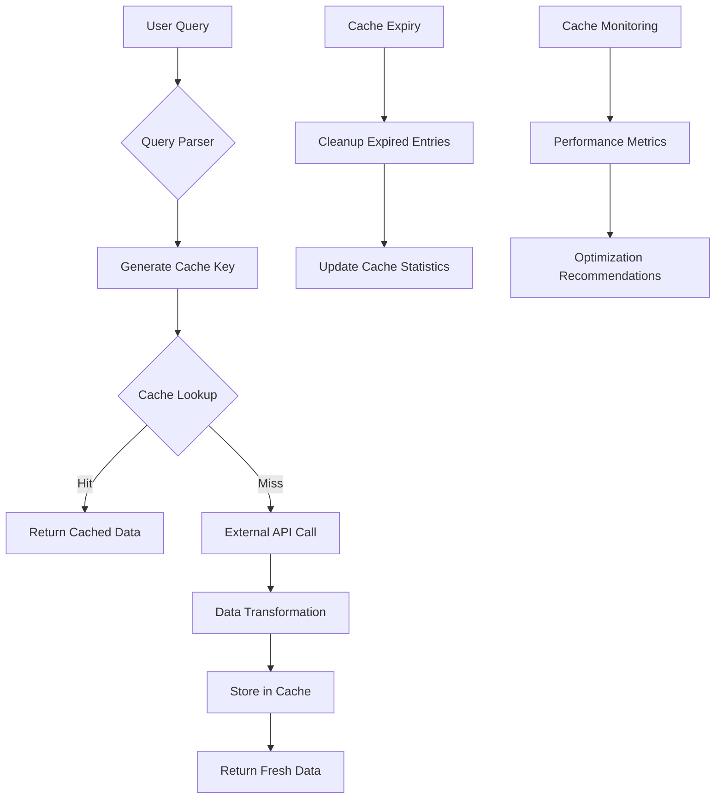
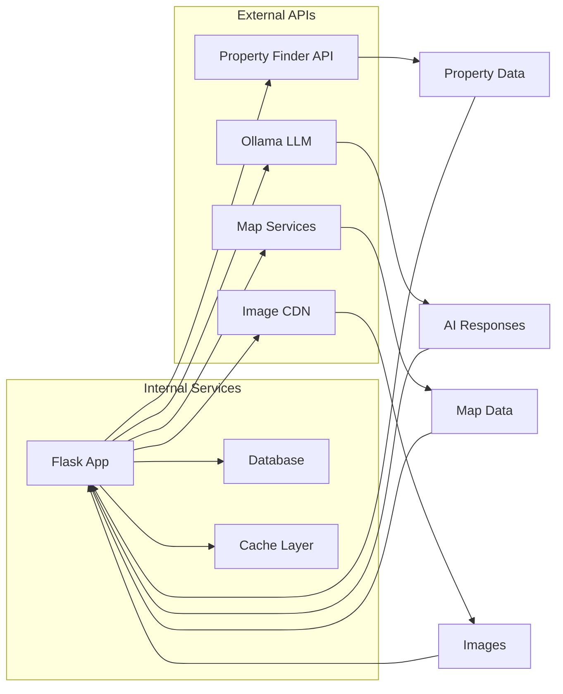
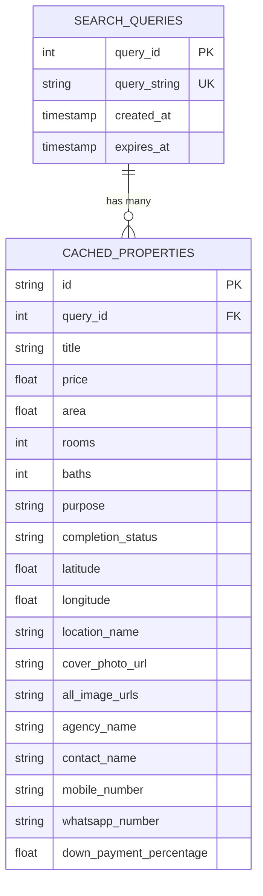
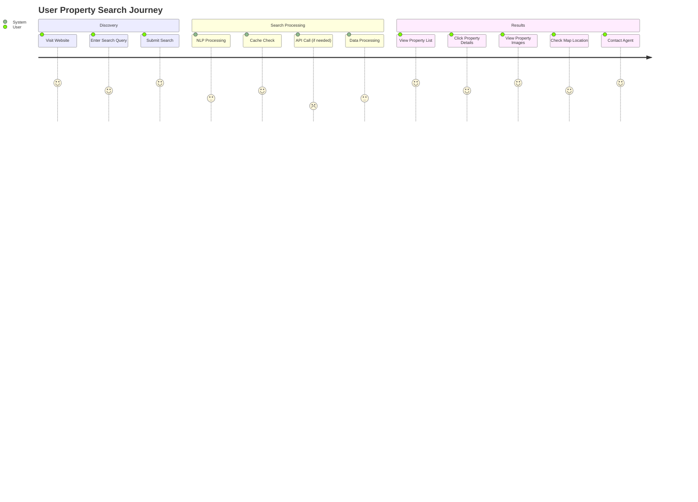
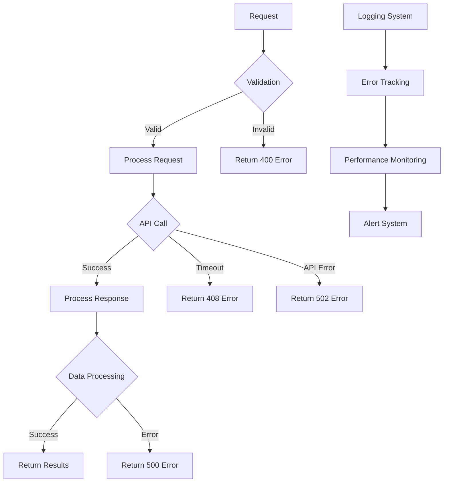
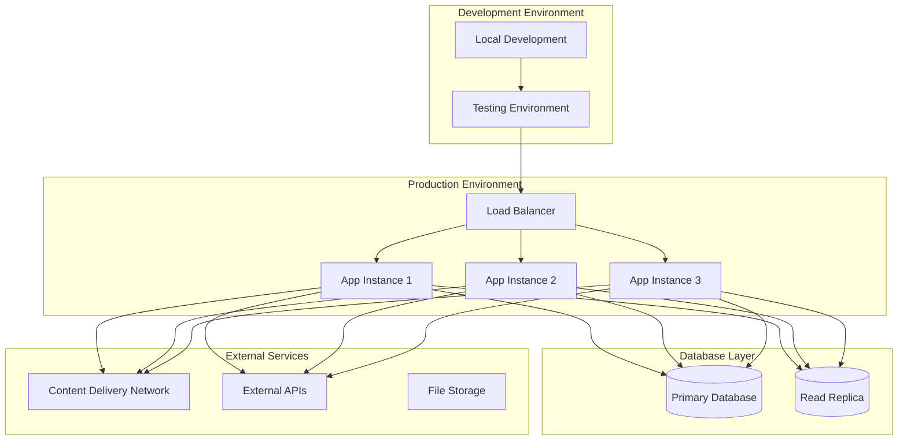
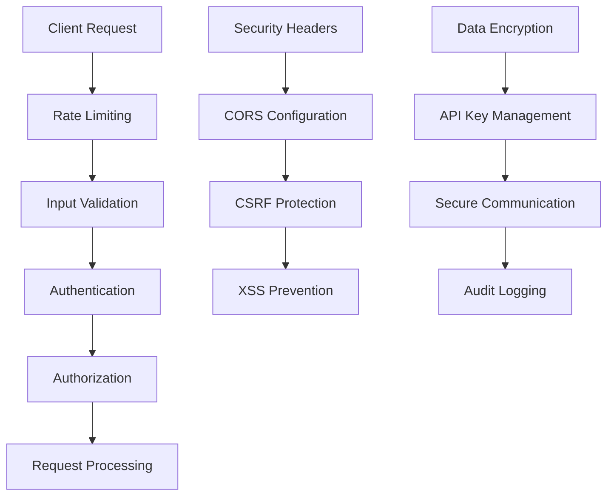
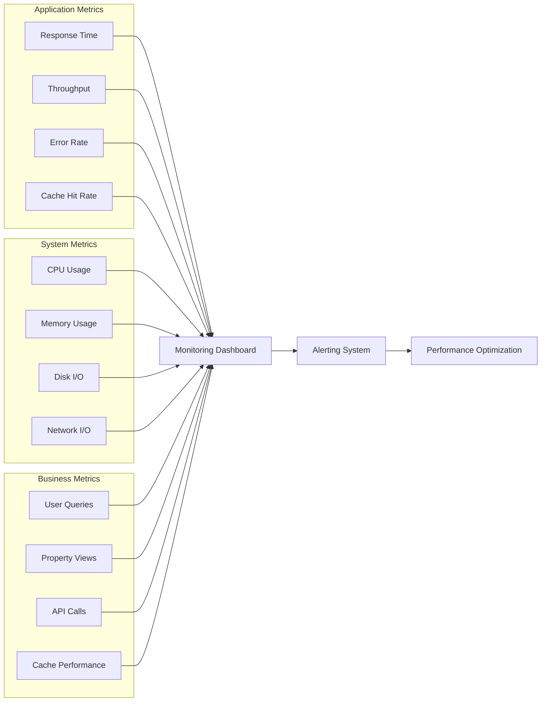

# System Architecture Diagrams

## 1. High-Level System Architecture

## 2. Data Flow Architecture

## 3. Caching Strategy Architecture

## 4. API Integration Architecture

## 5. Database Schema Relationships

## 6. User Journey Flow

## 7. Error Handling Architecture

## 8. Deployment Architecture

## 9. Security Architecture

## 10. Performance Monitoring Architecture

