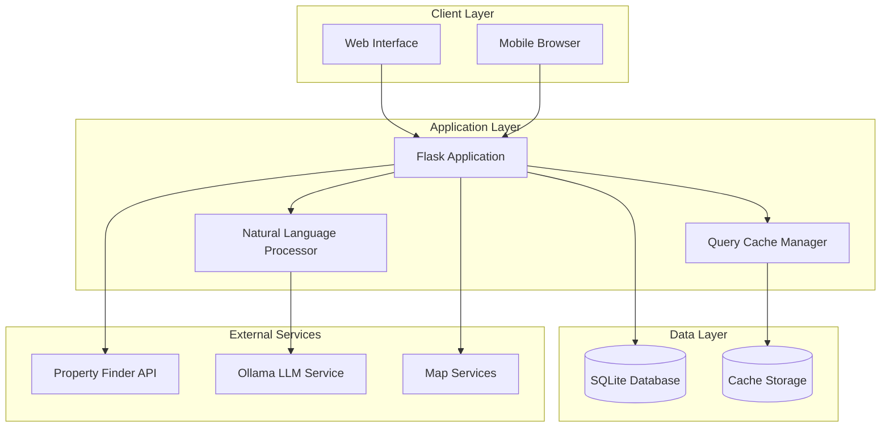
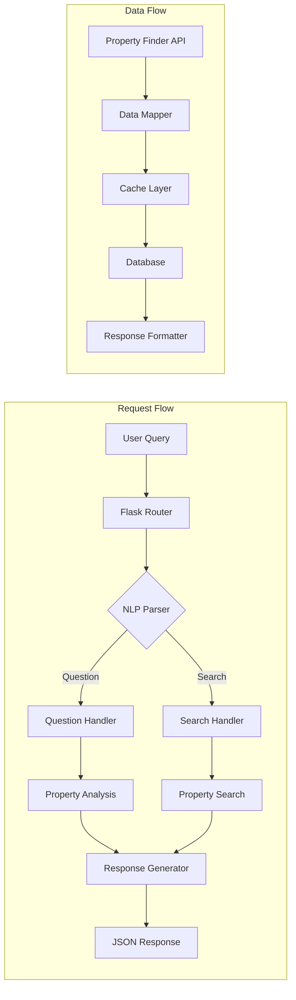
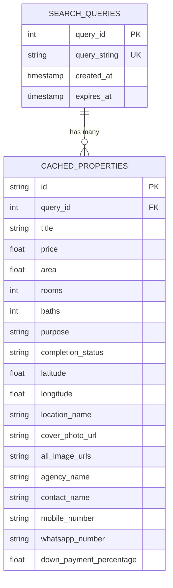
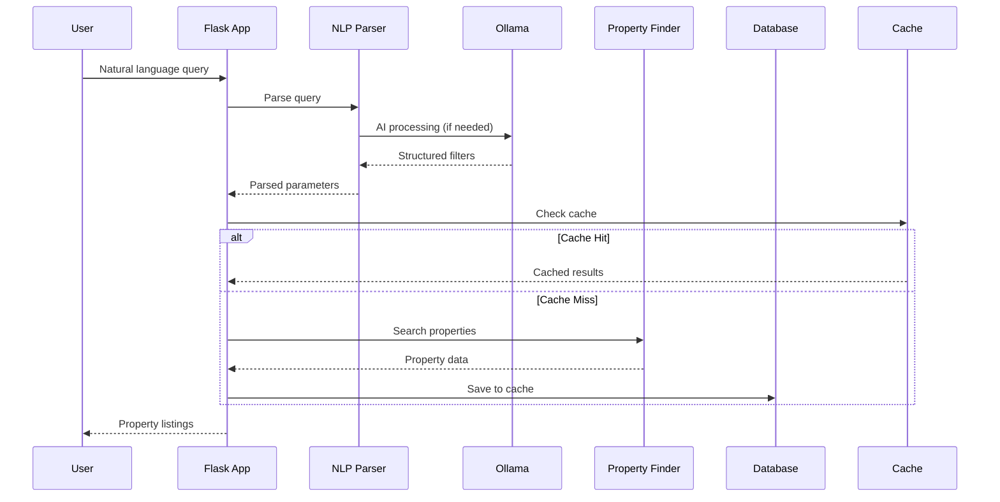
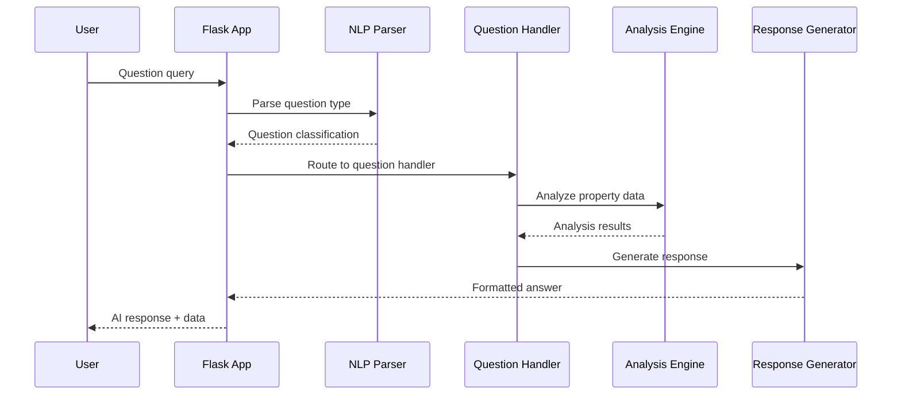
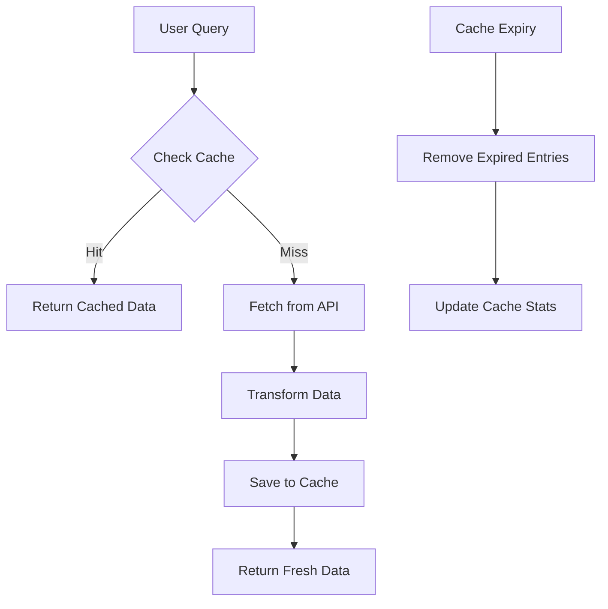

# Real Estate AI Chatbot - Comprehensive Project Documentation

## Table of Contents
1. [Project Overview](#project-overview)
2. [System Architecture](#system-architecture)
3. [Component Details](#component-details)
4. [API Documentation](#api-documentation)
5. [Database Schema](#database-schema)
6. [User Workflows](#user-workflows)
7. [Deployment Guide](#deployment-guide)
8. [Team Onboarding](#team-onboarding)
9. [Action Items](#action-items)

---

## Project Overview

### 🎯 **Project Mission**
An intelligent real estate search platform that enables users to find properties using natural language queries, powered by AI-driven property data aggregation and caching.

### 🚀 **Key Features**
- **Natural Language Processing**: Convert conversational queries into structured search parameters
- **Real-time Property Data**: Integration with Property Finder API for live property listings
- **Intelligent Caching**: 30-minute cache system for improved performance
- **Interactive Maps**: Location-based property visualization
- **Price Estimation**: AI-powered property valuation
- **Multi-modal Search**: Support for questions, searches, and price estimates

### 📊 **Technical Stack**
- **Backend**: Python Flask
- **Database**: SQLite with caching layer
- **AI/ML**: Ollama (LLaMA 3) for natural language processing
- **External APIs**: Property Finder API
- **Frontend**: HTML5, CSS3, JavaScript, Leaflet Maps
- **Deployment**: Railway/Render/Heroku ready

---

## System Architecture

### High-Level Architecture Diagram



### Detailed Component Architecture



---

## Component Details

### 1. **Flask Application (`app.py`)**
**Purpose**: Main application server and API endpoints

**Key Components**:
- **Routes**: `/api/nl_search`, `/api/search`, `/get_image`, `/map_view`
- **Search Engine**: Property search with caching
- **Question Handler**: AI-powered Q&A system
- **Price Estimator**: Property valuation engine

**Dependencies**:
```python
from flask import Flask, request, jsonify, render_template
from ollam import parse_natural_query, llama_fallback
import property_finder
import database
```

### 2. **Natural Language Processor (`ollam.py`)**
**Purpose**: Convert natural language to structured queries

**Key Functions**:
- `parse_natural_query()`: Regex-based parsing
- `llama_fallback()`: AI-powered parsing with LLaMA 3
- `_split_location_and_keywords()`: Location extraction

**Supported Query Types**:
- Property searches: "villas for sale in Dubai Marina"
- Questions: "What's the average price of apartments in Downtown?"
- Price estimates: "How much is my 3-bedroom villa worth?"

### 3. **Property Finder Integration (`property_finder.py`)**
**Purpose**: Real-time property data from Property Finder API

**Key Functions**:
- `search_location()`: Location name resolution
- `property_finder_search()`: Main search orchestrator
- `fetch_propertyfinder_listings()`: API data retrieval
- `_map_pf_data_to_db_schema()`: Data transformation

**API Integration**:
- Location search endpoint
- Property listings endpoint
- Image proxy service
- Build ID management

### 4. **Database Layer (`database.py`)**
**Purpose**: Caching and data persistence

**Key Functions**:
- `init_db()`: Database initialization
- `find_cached_query()`: Cache lookup
- `save_query_and_properties()`: Cache storage
- `get_properties_for_query()`: Cache retrieval

**Cache Strategy**:
- 30-minute TTL (Time To Live)
- Query-based cache keys
- Automatic expiration

### 5. **Frontend Interface (`templates/index.html`)**
**Purpose**: User interface for property search

**Features**:
- Natural language search input
- Property cards with images
- Interactive modals
- Map integration
- Image galleries
- Responsive design

---

## API Documentation

### Core Endpoints

#### 1. **POST `/api/nl_search`**
**Purpose**: Natural language property search

**Request**:
```json
{
  "query": "all current villa for sale in Damac hills"
}
```

**Response**:
```json
[
  {
    "id": "15316766",
    "title": "Vacant | Golf Course and Pool View | High ROI",
    "price": 1200000,
    "area": 743,
    "rooms": 1,
    "baths": 1,
    "purpose": "Residential for Sale",
    "location_name": "Golf Promenade 3B, Golf Promenade, DAMAC Hills, Dubai",
    "latitude": 25.0141658782959,
    "longitude": 55.25063705444336,
    "cover_photo_url": "https://www.propertyfinder.ae/property/...",
    "agency_name": "ALH PROPERTIES",
    "contact_name": "Ken Michael Gelera",
    "mobile_number": "+971565202365"
  }
]
```

#### 2. **GET `/api/search`**
**Purpose**: Structured property search

**Parameters**:
- `purpose`: "for-sale" | "for-rent"
- `rooms`: Number of bedrooms
- `baths`: Number of bathrooms
- `min_price`: Minimum price filter
- `max_price`: Maximum price filter
- `page`: Page number
- `limit`: Results per page

#### 3. **GET `/get_image`**
**Purpose**: Image proxy service

**Parameters**:
- `url`: Image URL to proxy

#### 4. **GET `/map_view`**
**Purpose**: Property location map

**Parameters**:
- `lat`: Latitude
- `lng`: Longitude

---

## Database Schema

### Entity Relationship Diagram



### Table Definitions

#### **search_queries**
```sql
CREATE TABLE search_queries (
    query_id INTEGER PRIMARY KEY AUTOINCREMENT,
    query_string TEXT UNIQUE NOT NULL,
    created_at TIMESTAMP NOT NULL DEFAULT CURRENT_TIMESTAMP,
    expires_at TIMESTAMP NOT NULL
);
```

#### **cached_properties**
```sql
CREATE TABLE cached_properties (
    id TEXT NOT NULL,
    query_id INTEGER NOT NULL,
    title TEXT NOT NULL,
    price REAL,
    area REAL,
    rooms INTEGER,
    baths INTEGER,
    purpose TEXT,
    completion_status TEXT,
    latitude REAL,
    longitude REAL,
    location_name TEXT,
    cover_photo_url TEXT,
    all_image_urls TEXT,
    agency_name TEXT,
    contact_name TEXT,
    mobile_number TEXT,
    whatsapp_number TEXT,
    down_payment_percentage REAL,
    PRIMARY KEY (id, query_id),
    FOREIGN KEY (query_id) REFERENCES search_queries (query_id)
);
```

---

## User Workflows

### 1. **Property Search Workflow**



### 2. **Question Answering Workflow**



### 3. **Caching Strategy**



---

## Deployment Guide

### 1. **Local Development Setup**

```bash
# Clone repository
git clone <repository-url>
cd real-estate-app-chatbot

# Create virtual environment
python -m venv venv
source venv/bin/activate  # On Windows: venv\Scripts\activate

# Install dependencies
pip install -r requirements.txt

# Initialize database
python -c "from app import app; app.app_context().push(); import database; database.init_db()"

# Run application
python app.py
```

### 2. **Production Deployment**

#### **Railway Deployment**
```bash
# Install Railway CLI
npm install -g @railway/cli

# Login and deploy
railway login
railway init
railway up
```

#### **Render Deployment**
1. Connect GitHub repository
2. Set build command: `pip install -r requirements.txt`
3. Set start command: `python app.py`
4. Deploy

#### **Heroku Deployment**
```bash
# Install Heroku CLI
# Create app
heroku create your-app-name

# Deploy
git push heroku main
```

### 3. **Environment Variables**
```bash
# Production settings
FLASK_ENV=production
PORT=5000
DATABASE_URL=sqlite:///bayut_properties.db
```

---

## Team Onboarding

### 1. **Developer Onboarding Checklist**

#### **Prerequisites**
- [ ] Python 3.8+ installed
- [ ] Git installed
- [ ] Code editor (VS Code recommended)
- [ ] Postman/Insomnia for API testing

#### **Setup Steps**
1. **Clone Repository**
   ```bash
   git clone <repository-url>
   cd real-estate-app-chatbot
   ```

2. **Environment Setup**
   ```bash
   python -m venv venv
   source venv/bin/activate
   pip install -r requirements.txt
   ```

3. **Database Initialization**
   ```bash
   python -c "from app import app; app.app_context().push(); import database; database.init_db()"
   ```

4. **Run Application**
   ```bash
   python app.py
   ```

5. **Test API Endpoints**
   ```bash
   curl -X POST -H "Content-Type: application/json" \
   -d '{"query": "villas for sale in Dubai"}' \
   http://localhost:5000/api/nl_search
   ```

### 2. **Codebase Understanding**

#### **Key Files to Review**
1. **`app.py`** - Main application logic
2. **`ollam.py`** - Natural language processing
3. **`property_finder.py`** - External API integration
4. **`database.py`** - Data persistence
5. **`templates/index.html`** - Frontend interface

#### **Architecture Patterns**
- **MVC Pattern**: Flask routes (Controller), Templates (View), Database (Model)
- **Caching Strategy**: Query-based caching with TTL
- **API Integration**: External service abstraction
- **Error Handling**: Graceful degradation and fallbacks

### 3. **Development Guidelines**

#### **Code Standards**
- Follow PEP 8 Python style guide
- Use type hints where appropriate
- Write docstrings for all functions
- Implement proper error handling

#### **Testing Strategy**
```python
# Example test structure
def test_natural_language_parsing():
    result = parse_natural_query("villas for sale in Dubai")
    assert result['filters']['property_type'] == 'villa'
    assert result['filters']['query'] == 'Dubai'
```

#### **Debugging Tips**
- Use Flask debug mode for development
- Check logs for API errors
- Test with different query types
- Monitor cache performance

---

## Action Items

### 1. **Immediate Actions (Week 1)**

#### **Technical Setup**
- [ ] Set up development environment
- [ ] Review codebase architecture
- [ ] Test all API endpoints
- [ ] Understand caching mechanism
- [ ] Review external API integrations

#### **Documentation**
- [ ] Read through all code comments
- [ ] Understand database schema
- [ ] Review deployment configurations
- [ ] Test local development setup

### 2. **Short-term Goals (Week 2-4)**

#### **Feature Development**
- [ ] Implement additional property filters
- [ ] Add more question types to NLP
- [ ] Enhance error handling
- [ ] Improve caching strategy
- [ ] Add unit tests

#### **Performance Optimization**
- [ ] Optimize database queries
- [ ] Implement connection pooling
- [ ] Add response compression
- [ ] Monitor API response times

### 3. **Long-term Objectives (Month 2-3)**

#### **Scalability**
- [ ] Implement Redis caching
- [ ] Add load balancing
- [ ] Database optimization
- [ ] CDN integration

#### **Feature Enhancements**
- [ ] Machine learning price prediction
- [ ] Advanced search filters
- [ ] User preferences
- [ ] Property recommendations

### 4. **Monitoring and Maintenance**

#### **Production Monitoring**
- [ ] Set up application monitoring
- [ ] Database performance tracking
- [ ] API usage analytics
- [ ] Error rate monitoring

#### **Regular Maintenance**
- [ ] Database cleanup scripts
- [ ] Cache optimization
- [ ] Security updates
- [ ] Performance reviews

---

## Technical Specifications

### **Performance Requirements**
- **Response Time**: < 2 seconds for cached queries
- **API Latency**: < 5 seconds for fresh data
- **Concurrent Users**: Support 100+ simultaneous users
- **Cache Hit Rate**: Target 70%+ cache efficiency

### **Security Considerations**
- Input validation and sanitization
- SQL injection prevention
- CORS configuration
- Rate limiting implementation
- API key management

### **Scalability Planning**
- Horizontal scaling with load balancers
- Database sharding strategies
- CDN integration for static assets
- Microservices architecture consideration

---

## Conclusion

This real estate AI chatbot represents a sophisticated integration of natural language processing, real-time data aggregation, and intelligent caching. The system is designed for scalability, maintainability, and user experience optimization.

**Key Success Factors**:
1. **Robust Architecture**: Modular design with clear separation of concerns
2. **Intelligent Caching**: Performance optimization through strategic data caching
3. **AI Integration**: Natural language understanding for enhanced user experience
4. **Real-time Data**: Live property information from reliable sources
5. **Scalable Deployment**: Cloud-ready with multiple deployment options

**Next Steps for New Team Members**:
1. Complete the onboarding checklist
2. Set up local development environment
3. Review and understand the codebase
4. Test all functionality thoroughly
5. Begin contributing to feature development

This documentation serves as the foundation for effective team collaboration and successful project delivery.
